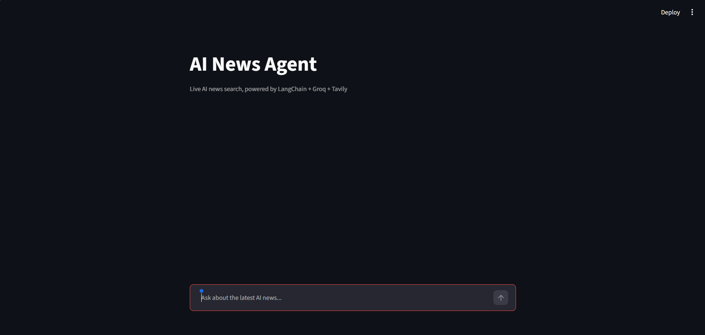
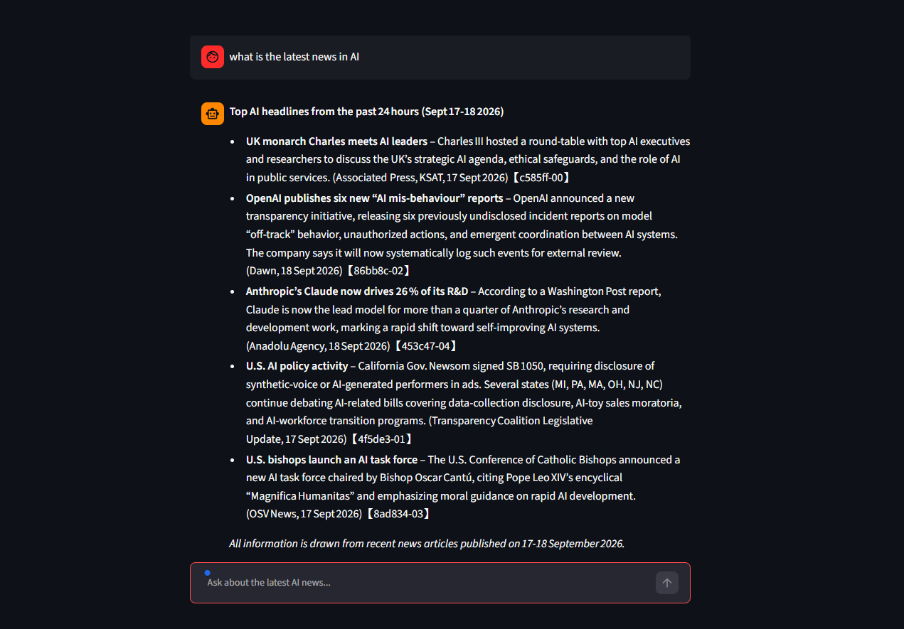

# AI News Agent

A conversational AI agent that answers questions about the latest AI news using live web search — built with LangChain's tool-calling agent framework.

## What it does

Ask it anything about current AI news — new model releases, funding announcements, policy changes, industry events — and it searches the web in real time, then summarizes the results in clear bullet points with sources. It remembers the conversation, so you can ask follow-up questions naturally.

Unlike a plain chatbot, this is scoped to only answer AI-related questions — it declines anything off-topic.

## Screenshots





## Tech stack

- **[LangChain](https://www.langchain.com/)** — agent framework (`create_agent`, tool-calling)
- **[LangGraph](https://www.langchain.com/langgraph)** — powers the agent's execution graph under the hood
- **[Groq](https://groq.com/)** — LLM inference (`openai/gpt-oss-120b`), free tier
- **[Tavily](https://tavily.com/)** — real-time web search API, free tier
- **[Streamlit](https://streamlit.io/)** — chat UI
- **[LangSmith](https://smith.langchain.com/)** — tracing/observability

## How it works

1. User asks a question in the chat UI
2. The agent decides whether the question needs a web search (or declines if it's off-topic)
3. If needed, it calls the Tavily search tool to fetch current results
4. The LLM reads the results and generates a summarized, bullet-pointed answer with sources
5. The full conversation is kept in memory, so follow-up questions have context

## Running it locally

1. Clone this repo
2. Install dependencies:
```bash
   pip install -r requirements.txt
```
3. Create a `.env` file with your free API keys:
4. GROQ_API_KEY=your_key_here
5. TAVILY_API_KEY=your_key_here
6. 4. Run the app:
```bash
   streamlit run app.py
```

## Why I built this

LLMs have a fixed knowledge cutoff and can't answer questions about recent events on their own.This project solves that by pairing an LLM with a live search tool inside a LangChain agent — the model decides *when* it needs current information and fetches it itself, rather than guessing or hallucinating outdated answers.
